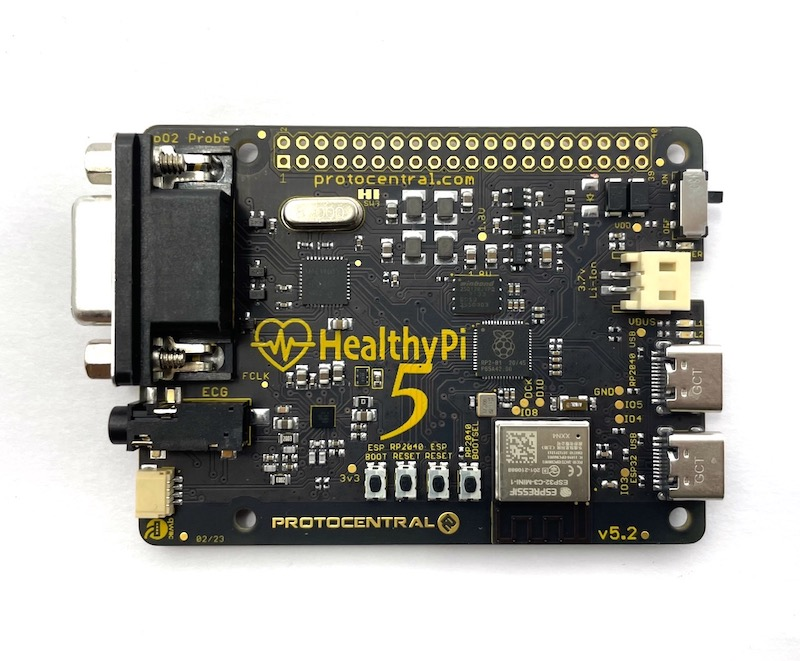
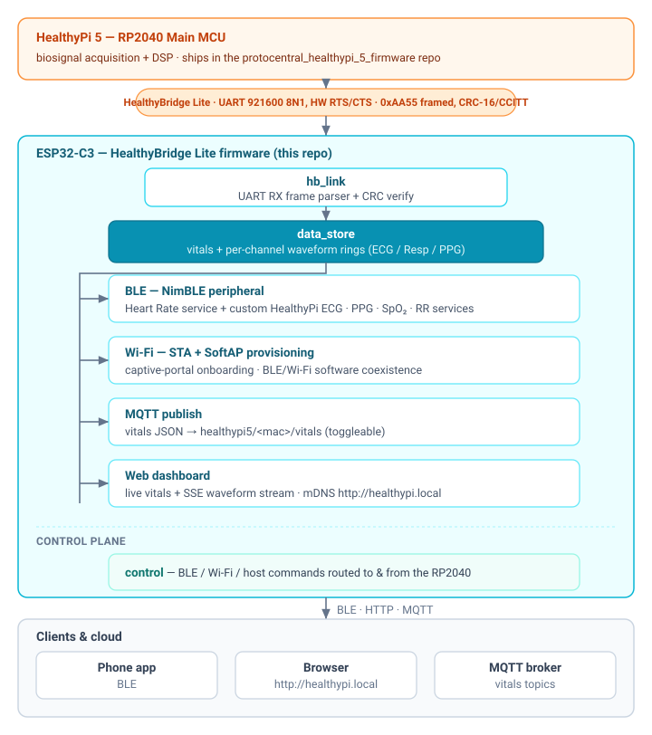

# HealthyBridge — BLE/Wi-Fi Bridge Firmware (ESP32-C3, ESP-IDF)

[](https://github.com/Protocentral/healthybridge-esp32/actions/workflows/build.yml)

> **HealthyBridge** turns an ESP32-C3 into a drop-in wireless co-processor: any
> host MCU speaks a small framed protocol over one UART, and this firmware
> bridges that data out over **BLE, Wi-Fi, MQTT and a local web dashboard** — the
> host needs no wireless stack of its own.
>
> It was developed primarily to add wireless connectivity to the dual-MCU
> **HealthyPi 5 NEXT** board (where the RP2040 Main MCU, separate repo
> [Protocentral/healthypi5_next_rp2040](https://github.com/Protocentral/healthypi5_next_rp2040),
> is the UART host), but it is **not tied to HealthyPi** — any project that needs
> to add BLE/Wi-Fi connectivity to a UART host can use it.

<p align="center">
  
</p>

<p align="center">
  <b>Buy a HealthyPi 5:</b>
  <a href="https://protocentral.com/product/healthypi-5-vital-signs-monitoring-hat-kit/">ProtoCentral Store</a>
  &nbsp;·&nbsp;
  <a href="https://www.mouser.com/c/?m=ProtoCentral&q=HealthyPi%205">Mouser</a>
</p>

**HealthyBridge** is generic wireless-bridge firmware for the **ESP32-C3**, built
on the **Espressif IoT Development Framework (ESP-IDF)** with the **NimBLE**
Bluetooth stack. The design goal is separation of concerns: a host MCU does all
of the real work (sensing, DSP, control) and hands finished data to the ESP32-C3
over a simple framed UART link — the **HealthyBridge** protocol — and this
firmware re-exposes it over **BLE, Wi-Fi, MQTT and a local web dashboard**. The
host stays fully fault-isolated from the radio: if Wi-Fi or BLE stalls, the host
is unaffected.

The **reference application** is the [ProtoCentral HealthyPi 5](https://protocentral.com/product/healthypi-5-vital-signs-monitoring-hat-kit/)
biosignal monitoring board (the **HealthyPi 5 NEXT** firmware), where the
[RP2040 Main MCU](https://github.com/Protocentral/healthypi5_next_rp2040) owns all
acquisition and DSP and streams vitals and waveforms across the link. The parts
below describe that application; only the payload set (vitals/ECG/PPG) and the
BLE service map are HealthyPi-specific — the framing, transport and connectivity
plumbing are reusable with any UART host.

## Hardware features (HealthyPi 5)

- **ESP32-C3** RISC-V co-processor with BLE 5 and 2.4 GHz Wi-Fi (this firmware)
- **RP2040** dual-core Main MCU running the acquisition firmware (separate repo)
- **MAX30001** (ECG / respiration) + **AFE4400** (PPG / SpO₂) analog front ends
- **MAX30205** I²C temperature and **MAX17048** battery fuel gauge
- MicroSD recording, Li-Ion charging, 40-pin Raspberry Pi HAT connector
- Dedicated USB Type-C to the ESP32-C3 for flashing and debugging

## Firmware features

- **HealthyBridge link** — UART frame parser (`0xAA55` framing, CRC-16/CCITT) consuming vitals/waveforms/battery from the host
- **BLE (NimBLE)** — advertises as "HealthyPi 5"; four standard SIG services plus the custom HealthyPi waveform and command services, so the existing phone app works unchanged (see below)
- **Wi-Fi STA** — connects with stored credentials, auto-reconnects, and falls back to the setup portal after repeated failures; BLE/Wi-Fi share the single 2.4 GHz radio via software coexistence
- **SoftAP captive-portal provisioning** — with no credentials, brings up an open `HealthyPi-XXXX` access point + captive DNS + HTTP form to onboard Wi-Fi, MQTT and dashboard settings, then reboots into STA
- **MQTT publish** — publishes vitals JSON (`hr`/`spo2`/`rr`/`temp`) to `healthypi5/<mac>/vitals` once per second (toggleable, broker URI configurable)
- **Local web dashboard** — live vitals + Server-Sent-Events waveform streaming (ECG/PPG) with a JSON-poll fallback, battery / Wi-Fi RSSI / BLE status chips, lead-off warnings, a settings form and a re-provision button; advertised over mDNS at `http://healthypi.local`
- **Command plane** — BLE / Wi-Fi / host commands routed to and from the host MCU; status reported back once per second

### BLE service map

Preserved verbatim from the legacy HealthyPi 5 firmware so existing clients keep working.

| Service | UUID | Characteristics |
|---|---|---|
| Heart Rate | `0x180D` | Heart Rate Measurement `0x2A37` |
| Battery | `0x180F` | Battery Level `0x2A19` |
| Pulse Oximeter | `0x1822` | SpO₂ Spot-Check `0x2A5E` |
| Health Thermometer | `0x1809` | Temperature `0x2A6E` |
| ECG + Respiration | `00001122-…` (128-bit) | ECG `00001424-…`, Resp `babe4a4c-…` |
| PPG + Resp-rate | `cd5c7491-…` (128-bit) | PPG `cd5c1525-…`, RR `cd5ca86f-…` |
| Command | `01bf7492-…` (128-bit) | TX (write) `01bf1528-…`, RX (notify) `01bf1527-…` |

## Host UART link

The host connects to the ESP32-C3 over **UART1 at 921600 baud, 8N1, with hardware
RTS/CTS flow control**. Wire your host to these ESP32-C3 pins (fixed in
[`main/hb_link.c`](main/hb_link.c)):

| ESP32-C3 | GPIO | dir | Host |
|---|---|:---:|---|
| TX  | GPIO6 | → | host RX  |
| RX  | GPIO7 | ← | host TX  |
| RTS | GPIO5 | → | host CTS |
| CTS | GPIO4 | ← | host RTS |

## Architecture

<p align="center">
  
</p>

## Install prebuilt firmware (no build)

The easiest way to flash or update a HealthyPi 5 ESP32-C3 — no toolchain required.

**Browser (simplest):** open the **[web installer](https://protocentral.github.io/healthybridge-esp32/)**
in Chrome or Edge, connect the ESP32-C3 USB Type-C port, and click *Install*.

**Command line:** from the [latest release](https://github.com/Protocentral/healthybridge-esp32/releases/latest),
download `healthybridge-esp32-merged.bin` (and the app-only binary if updating)
plus `flash.sh`/`flash.bat`, then `pip install esptool` and run:

```bash
./flash.sh <PORT>                 # full install (merged image @ 0x0)
./flash.sh <PORT> --app-only      # update the app only (@ 0x10000)
```

> A **full** install (merged image at `0x0`, and the browser installer) overwrites
> the NVS region, so it **erases stored Wi-Fi credentials and settings** — you'll
> re-provision over the SoftAP captive portal afterwards. Use `--app-only` to
> update the firmware while keeping settings. There is no over-the-air (OTA)
> update path: the partition table has a single `factory` app, so updates are over
> USB/serial only.

## Getting started

### 1. Install ESP-IDF

This firmware targets **ESP-IDF v6.0** or later (the managed components are pinned
in [`dependencies.lock`](dependencies.lock)). Follow the official
[ESP-IDF Get Started guide](https://docs.espressif.com/projects/esp-idf/en/latest/esp32c3/get-started/),
then load the environment in your shell:

```bash
. $IDF_PATH/export.sh
```

### 2. Clone the repository

```bash
git clone https://github.com/Protocentral/healthybridge-esp32.git
cd healthybridge-esp32
```

The MQTT and mDNS managed components are fetched automatically by the IDF
component manager on first build (from [`dependencies.lock`](dependencies.lock));
they are not vendored in the tree.

### 3. Build

```bash
idf.py set-target esp32c3
idf.py build
```

### 4. Flash & monitor

Connect the ESP32-C3 USB Type-C port and flash:

```bash
idf.py -p <PORT> flash monitor      # e.g. -p /dev/ttyACM0  (Ctrl-] to exit monitor)
```

### First-time provisioning

With no stored Wi-Fi credentials the device starts a **SoftAP captive portal** —
join its `HealthyPi-XXXX` access point and a form will open to enter your Wi-Fi
SSID/password and toggle the MQTT and dashboard options. The device then reboots
into station mode; the dashboard is reachable at **http://healthypi.local**.

## Security considerations

This firmware is designed for trusted local networks (lab benches, personal
LANs). It is **not hardened for hostile or untrusted networks**:

- The provisioning **SoftAP is an open network** (no password) so onboarding
  needs no pre-shared key. Anyone in radio range during provisioning can join it
  and submit the form. Provision somewhere you trust.
- Neither the **captive portal nor the dashboard has authentication**. Any host
  on the same network can read vitals, change MQTT/dashboard settings, and
  trigger a Wi-Fi re-provision. Both serve plain **HTTP**, not HTTPS.
- **Wi-Fi credentials are stored unencrypted in NVS.** Enable NVS encryption
  (and flash encryption) if physical access to the board is a concern.
- **MQTT** connects with whatever the broker URI specifies; `mqtt://` is
  unencrypted. Use `mqtts://` with a broker that supports TLS if the vitals
  stream leaves your network.
- Leave `HB_WIFI_DEFAULT_SSID`/`HB_WIFI_DEFAULT_PASS` in [`main/cfg.h`](main/cfg.h)
  **empty** in anything you build for others — they are a bench-testing
  convenience that bakes credentials into the binary.

## Documentation

The HealthyBridge wire protocol, the BLE service map, and the Wi-Fi / MQTT /
dashboard design notes live under [`docs/`](docs/). The companion Main-MCU
firmware is at
[Protocentral/healthypi5_next_rp2040](https://github.com/Protocentral/healthypi5_next_rp2040).

## Licensing

First-party firmware is **MIT** (see [LICENSE](LICENSE)). ESP-IDF and the managed
components (NimBLE, esp-mqtt, mDNS) retain their own licenses — see
[THIRD_PARTY_LICENSES.md](THIRD_PARTY_LICENSES.md).
